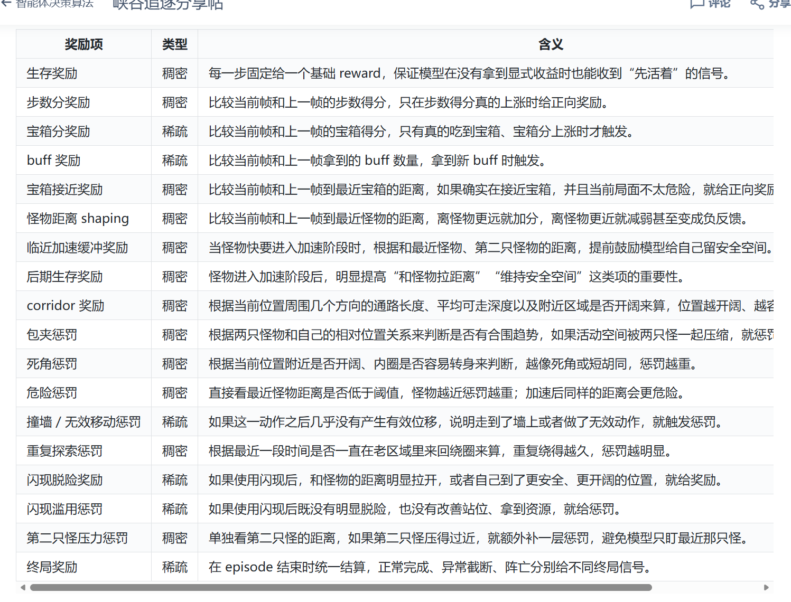

**特征工程**
如果只让我说一个最有效的部分，那我会选 特征工程。

baseline 给的特征不是不能用，但如果想继续提分，我觉得还是要重新思考：

智能体在决策时，到底真正需要看到什么？

我今年比较重视的几类信息是：

最近怪物距离
第二只怪物距离
最近宝箱方向和距离
当前闪现是否可用
距离怪物加速还有多久
当前是否已经进入高压阶段
周围地形是不是容易卡死
也就是说，我更在意的是决策相关特征，而不是把环境原始字段尽量全塞进去。

我自己大致是把特征拆成了下面几组去理解：

英雄主特征
这部分主要负责回答“我现在是什么状态”。 比如当前位置相关状态、当前分数进展、闪现是否可用、已经进入第几个阶段、最近是否卡住、最近是否在重复绕路等。
宝箱特征
这部分主要回答“现在哪个资源值得追”。 我比较关心的是宝箱是否还有效、和自己相对方向、相对距离、当前危险度大不大，以及它是不是处在一个值得去拿的位置。
怪物特征
这部分主要回答“危险从哪里来”。 除了最近怪物距离，我觉得第二只怪物的位置也很重要，因为很多时候真正的危险不是某一只怪贴脸，而是两只怪在压你的活动空间。
技能 / buff 特征
这部分主要回答“我现在还有没有操作空间”。 比如闪现是否可用、buff 有没有拿到、现在是该贪一点还是该保一点。
局部地图特征
这部分主要回答“我往哪边走更安全”。 我自己的体感是，这个题后期不是单纯知道怪物近就够了，更重要的是知道附近有没有开阔区域、有没有长走廊、有没有死角。
这个题的 observation 不能只回答“环境里有什么”，还要尽量回答：

我现在危险不危险
我现在有没有机会拿资源
我往哪里走更安全
我是应该继续拿分，还是该准备保命
我自己的感觉是：

如果特征能同时把“危险”和“机会”说清楚，模型会聪明很多。

**奖励函数**

